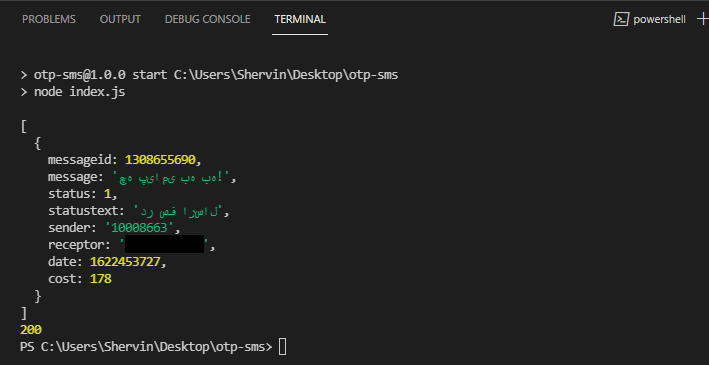

# 
وبسرویس پیامک

این ریپوسیتوری برای اهداف آموزشی در جونیور فرانت اند تهیه شده است. 

اینجا از API شرکت کاوه نگار استفاده کردیم. میتوانستیم از هر شرکت دیگری استفاده کنیم. 

اینجا از حالت خاصی از وبسرویس به نام OTP استفاده میکنیم. فعلا قصد نداریم به تعداد زیادی پیامک تبلیغاتی بفرستیم. فقط برای تایید شماره موبایل استفاده میکنیم.

[مقاله مربوطه](https://juniorfrontend.ir/otp-sms)

کافیست مقادیر `YOUR-MOBILE-NUMBER` و `YOUR-API-KEY` را وارد نمایید.

برای بدست اوردن `YOUR-API-KEY` کافیست در سایت کاوه نگار ثبت نام کنید. 
نیازی به این نیست در کاوه نگار هزینه پرداخت کنید. مقدار 1000 تومان شارژ رایگان برای تست برایتان در نظر گرفته شده است. 

سپس پکیج `kavenegar` را نصب کنید و در ترمینال `npm start` را بزنید!

کار بسیار ساده ای است. 

در ترمینال باید پیام این چنینی ببینید و یک اس ام اس هم به شما ارسال شده باشد. 

